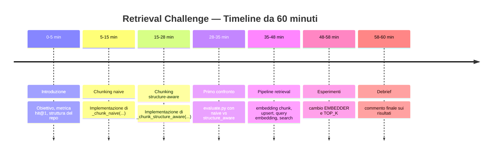

# Esercizio ponte tra Lez 01 e 02 — Retrieval challenge

> Consolidamento di **chunking**, **ingestion** e **retrieval** su un corpus reale. Durata consigliata: **60 minuti**. Per questa lezione ci focalizziamo al recupero dei chunk giusti.

## Lo scenario

Sei un/una AI engineer e ti viene dato un piccolo corpus di documentazione in italiano su due diversi **database vettoriali** (Qdrant e Pinecone). Devi costruire la pipeline che, data una domanda tecnica, recupera i pezzi di documentazione che contengono la risposta.

Hai già lo scheletro del progetto e un **giudice automatico** (`evaluate.py`) che misura quanto bene recuperi: ti dice, su un insieme di domande, in quante hai trovato la fonte giusta. Il tuo lavoro è:

1. implementare due strategie di chunking (viste la scorsa lezione)
2. completare ingestion e retrieval
3. confrontare i risultati e migliorare il punteggio

## Come si vince questa challenge senza premi?

Il punteggio è **`hit@k`**: su `N` domande del gold set, in quante almeno uno dei primi `k` chunk recuperati viene dal file giusto. Il giudice lo riporta a tre profondità:

```
  hit@1 =  9/14  ( 64%)  <- punteggio principale (ranking)
  hit@2 = 13/14  ( 93%)
  hit@3 = 14/14  (100%)
```

**`hit@1` è la misura che conta**: vuol dire che il chunk giusto è arrivato *primo*, cioè che il retrieval ha davvero capito la domanda. `hit@2` e `hit@3` sono più indulgenti. La sfida è far salire soprattutto `hit@1`.

> Nota: è una verifica volutamente semplice. La valutazione del retrieval (recall, precision, MRR...) sarà argomento della prossima lezione.

## Le regole d'ordine

Questo progetto è strutturato come un progetto vero, e va tenuto tale:

- **Tutti i parametri stanno in `config.py`.** Niente numeri sparsi nel codice.
- **Ingestion, retrieval e valutazione vivono in file separati.**
- **I dati stanno in `data/`**.

> Questa è una possibile struttura con cui io mi trovo bene a lavorare.

## Cosa devi completare

Cinque `# TODO`, tutti su cose già viste a lezione:

| File | TODO | Cosa |
|------|------|------|
| `src/ingest.py` | TODO 1 | Implementare `_chunk_naive(...)` |
| `src/ingest.py` | TODO 2 | Implementare `_chunk_structure_aware(...)` |
| `src/ingest.py` | TODO 3 | Embeddare i chunk |
| `src/ingest.py` | TODO 4 | Caricarli su Qdrant (`store.add`) |
| `src/retrieve.py` | TODO 5 | Embeddare la query e cercare i `k` vicini |

Quando i TODO sono fatti, `python scripts/evaluate.py` produce un punteggio.

## Le leve da tunare

Tutte in `config.py`:

1. **`CHUNKER`** — quale chunker usare nel confronto iniziale.
   - `"naive"` → taglio a caratteri fissi
   - `"structure_aware"` → segue meglio la struttura markdown e prova a non
     spezzare i blocchi di codice
2. **`EMBEDDER`** — quale modello di embedding usare.
   - `openai` → `text-embedding-3-small` (serve la chiave)
   - `minilm-it`, `e5-small`, `bge-m3` → **locali e gratuiti**, multilingue
   - `minilm-en` → **locale e gratuito ma solo inglese**
   - guarda su hugging face se ci sono altri modelli adatti all'italiano!
3. **`TOP_K`** — quanti chunk recuperi.
4. **`CHUNK_MAX_CHAR`** e **`CHUNK_OVERLAP`**: leva secondaria, utile quando
   hai già chiuso il confronto principale.

> ⚠️ Ogni modello produce vettori di dimensione diversa (`384`, `1024`,`1536`, ...). Qdrant deve sapere questa dimensione quando crea la collection, altrimenti non può accettare o confrontare correttamente i vettori. Per questo lo starter legge `embedder.dim` e crea l'indice con la dimensione giusta.

## Percorso guidato

### Parte A — Chunking

Inizia da `src/ingest.py`:

1. completa `_chunk_naive(...)`
2. completa `_chunk_structure_aware(...)`

Qui l'obiettivo è creare le due strategie che confronterai più avanti.

### Parte B — Retrieval pipeline

Completa il resto della pipeline:

1. embedding dei chunk
2. upsert su Qdrant
3. embedding della query
4. retrieval dei `k` vicini

Quando questa parte gira, puoi lanciare il giudice.

### Parte C — Esperimenti

Il **primo confronto obbligatorio** è tra i due chunker:

1. esegui `evaluate.py` con `CHUNKER = "naive"`
2. esegui `evaluate.py` con `CHUNKER = "structure_aware"`
3. confronta soprattutto **`hit@1`**

Solo dopo fai altri esperimenti:

1. cambia `EMBEDDER`
2. cambia `TOP_K`
3. se avanza tempo, prova `CHUNK_MAX_CHAR`

## Come partire

```bash
# 1. attiva il venv del corso (lo stesso della scorsa lezione)
#    oppure installa da requirements.txt
#
# 2. implementa i TODO in src/ingest.py e src/retrieve.py
#
# 3. fai il primo confronto obbligatorio:
#    - CHUNKER = "naive"
#    - CHUNKER = "structure_aware"
#
# 4. rilancia il giudice ogni volta
python scripts/evaluate.py
```

Default iniziali:

- `CHUNKER = "naive"`
- `EMBEDDER = "minilm-it"`
- `TOP_K = 3`

Il default di `EMBEDDER` parte **senza chiave**. Se vuoi provare `openai`,
copia `.env.example` in `.env` e metti la chiave.

## Timeline (60 min)



## Struttura del progetto

```
S07_Capstone_Retrieval/
├── README.md            # questa consegna
├── config.py            # TUTTI i parametri (chunker, modello, top_k, ...)
├── .env.example         # template dei secrets
├── requirements.txt
├── data/
│   ├── corpus/          # 8 documenti .md (Qdrant + Pinecone)
│   └── gold/queries.json# le domande con la fonte attesa
├── solution/            # risolto da me, non guardarlo :)
│   ├── ingest.py
│   └── retrieve.py
├── src/
│   ├── embeddings.py    # factory: cambi modello con una stringa
│   ├── ingest.py        # load → chunk → embed → upsert   (4 TODO)
│   └── retrieve.py      # query → search → top_k          (1 TODO)
└── scripts/
    └── evaluate.py      # il giudice (hit@k). Non toccatelo salvo errori miei :)
```

## Sfide bonus

- **Retrieval filtrato**: implementa `retrieve_filtered` in `src/retrieve.py`
  per cercare solo dentro un file specifico.
- **Caccia all'errore**: trova una domanda del gold set che sbagli sempre. È
  colpa del chunking, dell'embedding o di com'è scritta la domanda?
- **La tua domanda**: aggiungi una riga al gold set e verifica che la pipeline
  la gestisca.
